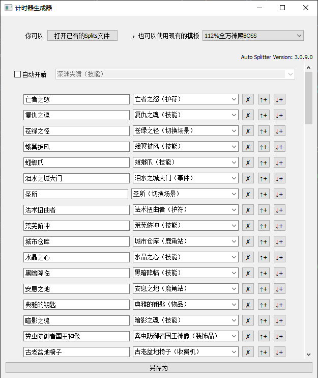

# 空洞骑士计时器生成器（中文版）


[](https://github.com/CuteReimu/hksplitmaker/actions/workflows/golangci-lint.yml "Analysis")
[](https://github.com/CuteReimu/hksplitmaker/blob/master/LICENSE "LICENSE")



> [!Note]
> 本项目只能在Windows环境下运行。

## 一键更新LiveSplit的空洞骑士Auto Splitter插件

关闭LiveSplit，运行`hksplitmaker.exe`，点击右上角的`更新LiveSplit`按钮，按照接下来的提示操作即可。

## 如何使用

1. 运行`hksplitmaker.exe`

2. 你可以选择一个已有的模板或者打开一个lss文件，也可以自己从头开始编辑

3. 点击右侧的加号和删除可以增加或者删除一行

4. 第一列的文本框里填写自己想要显示的片段名称，第二列的下拉框用来选择在游戏中会自动分割的触发事件。

5. 如果是一个全关速通或者万神殿某一门的速通，不需要勾选`自动开始`

6. 最后一行的复选框的意思是：
   - 如果你想要以**游戏结束**（打出任何一个结局）为计时器结束的标志，那么请勾上这个复选框；
   - 如果你想要以**并非游戏结束**的一个事件作为计时器结束的标志，那么请不要勾选这个复选框。

7. 全部设置好以后，点击下方的`另存为`按钮，即可保存成Splits文件。

8. 打开LiveSplit -> 右键 -> Open Splits -> From File... ，选择刚刚保存的文件即可。

## 编译说明

**根据自己的编译环境，运行`build.bat`或`build.sh`即可进行编译。**

如果想要自己使用`go build`进行编译，需要提前下载两个文件：

```shell
curl -O https://raw.githubusercontent.com/LiveSplit/LiveSplit.AutoSplitters/master/LiveSplit.AutoSplitters.xml
curl -O https://raw.githubusercontent.com/ShootMe/LiveSplit.HollowKnight/master/Components/LiveSplit.HollowKnight.dll

# -ldflags中，-s是去掉符号表，-w是去掉调试信息，均可减小所生成二进制文件的体积
# -H=windowsgui是打开Windows窗口时隐藏控制台的黑框框
GOOS=windows GOARCH=amd64 go build -ldflags "-s -w -H=windowsgui" -o hksplitmaker.exe
```

## 如何优化翻译

请不要直接在这个repo修改`translate.csv`文件，请前往[CuteReimu/hk-split-maker](https://github.com/CuteReimu/hk-split-maker)修改，修改后会自动同步到这里。

## 特别鸣谢

本程序的所有**非代码部分**（图标和模板）全部都来自：https://hksplitmaker.com/

该项目的Github地址是：https://github.com/slaurent22/hk-split-maker
